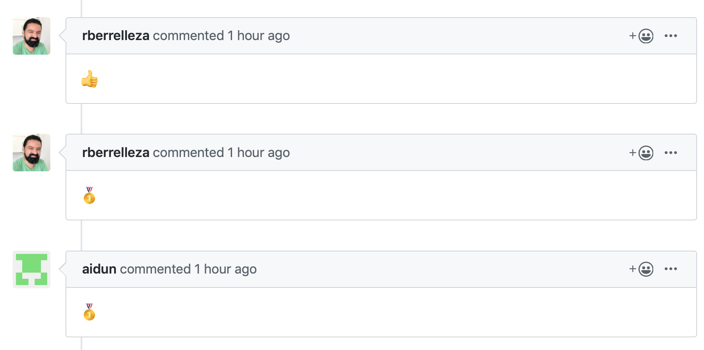

## comment-vibes

Figure out the vibe of your community through emoji comments.

## Kubernetes / Serverless example project

This sample uses the OpenFaaS [golang-middleware](https://github.com/openfaas-incubator/golang-http-template/) template and three endpoints:

* view - to render a HTML template (server-side)
* import-comment - to receive and validate the webhook, then update postgres
* comments - to render JSON from a postgres function

You can see the results in the demo below. Feel free to try it out, if the endpoint is still up.

The code is adapted from the [Serverless Single Page App - aka Open Source leaderboard](https://github.com/alexellis/leaderboard-app/)

## Demo

Example output view the `/view` function:


Example input from a GitHub issue and webhook:



[Tester issue](https://github.com/teamserverless/proposals/issues/1)

## Create a postgres DB

You can use [DigitalOcean](https://digitalocean.com) managed Postgres for example.

## Populate it with the schema

```
psql postgresql://connection-string here
```

Paste in [schema.sql](schema.sql)

## Create your secrets:

```bash
export USERNAME=""
export PASSWORD=""
export HOST=""
export WEBHOOK_SECRET=""

faas-cli secret create username --from-literal $USERNAME
faas-cli secret create password --from-literal $PASSWORD
faas-cli secret create host --from-literal $HOST
faas-cli secret create webhook-secret --from-literal $WEBHOOK_SECRET
```

## Deploy to OpenFaaS (Intel)

```
# Get the additional template
faas-cli template store pull golang-middleware

# Deploy

faas-cli deploy
```

## Rebuild and deploy (Intel and ARM)

```
sed -i stack.yml s/alexellis2/your-docker-hub/g
export DOCKER_BUILDKIT=1

faas-cli up --tag=sha
```

## Setup GitHub webhooks

Go to Settings for your repo and click "Webhooks"

Add a webhook


Pick only the issue comments event, there is no issue for reactions at this time.


Now have someone send a comment to one of the issues in your repo with an emoji i.e. 👍

If you need to create a HTTP tunnel to your local computer, try [inlets and inletsctl](https://docs.inlets.dev/)

View the result on the `/view` function.
